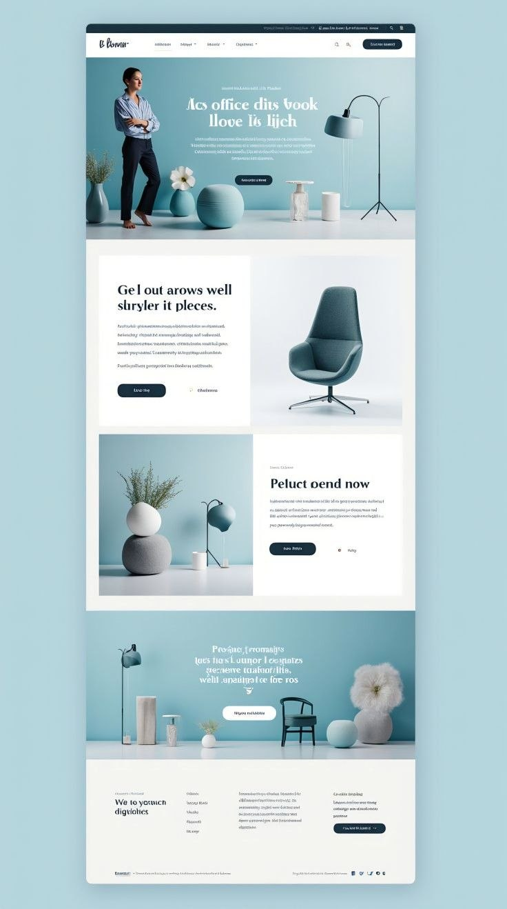

#🎨 Design ➡️ Code: New Project Ready! 🚀

​A new minimalist interior website for my portfolio. I designed this project in Figma and then brought it to life!

## ​🛠️ Technical Part:
​Design: Figma ✍️
​Code: HTML, CSS and Bootstrap 5 📱
​Result: Clean UI/UX and perfect responsiveness.

​## 💡 An interior website that combines tranquility and modernity. 🧘‍♀️
​What I achieved with this project:
​🎨 Colors: Calming white-blue palette. (Freshness!)
​📐 UI/UX: Intuitive navigation and clean look. (Easy to use!)
​✨ Aesthetics: Minimalism and elegance in every detail. (Simply beautiful!)

